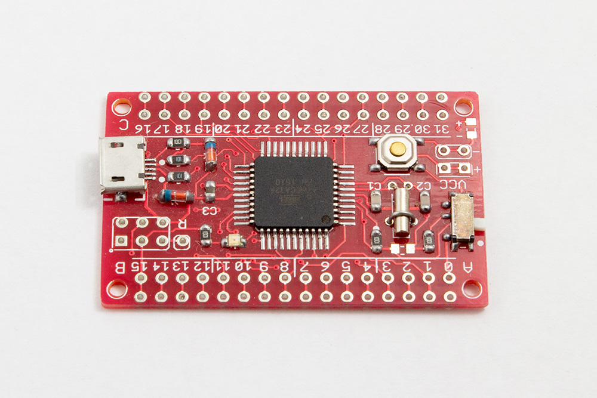
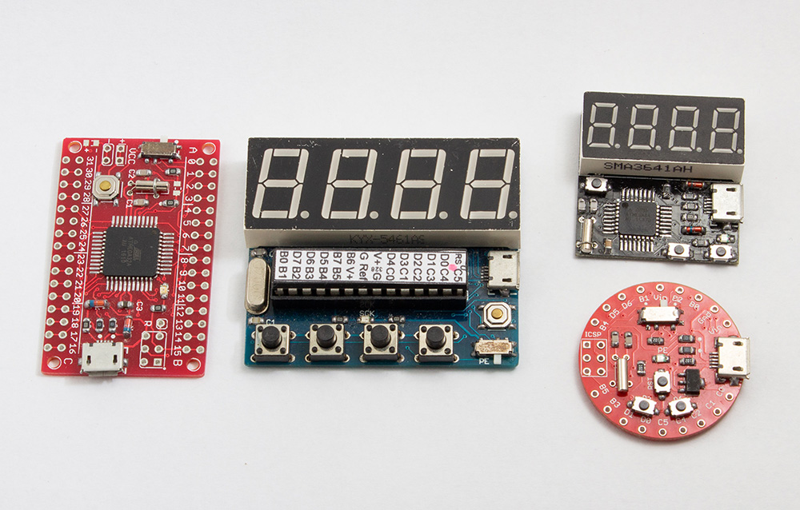
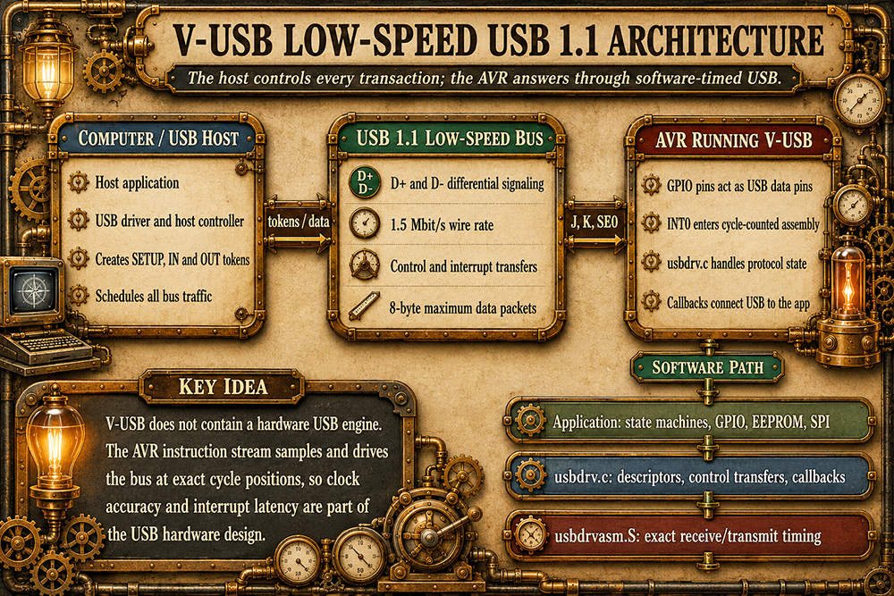
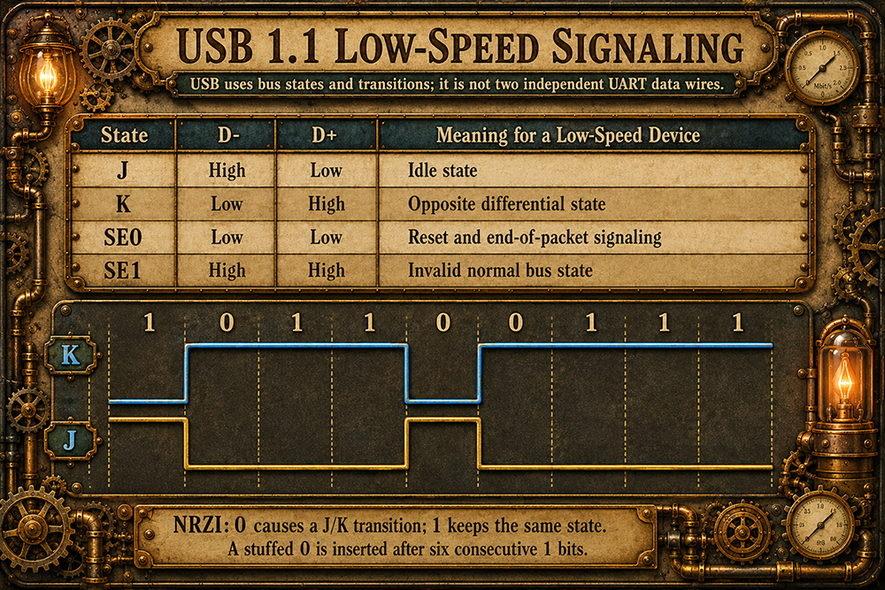
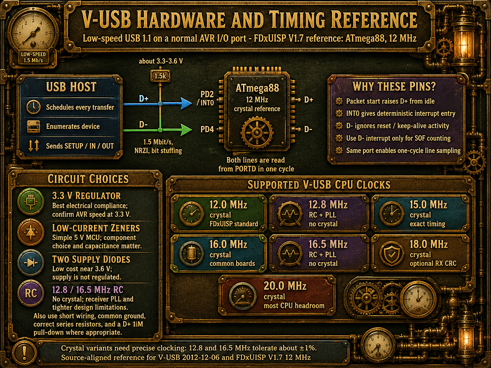
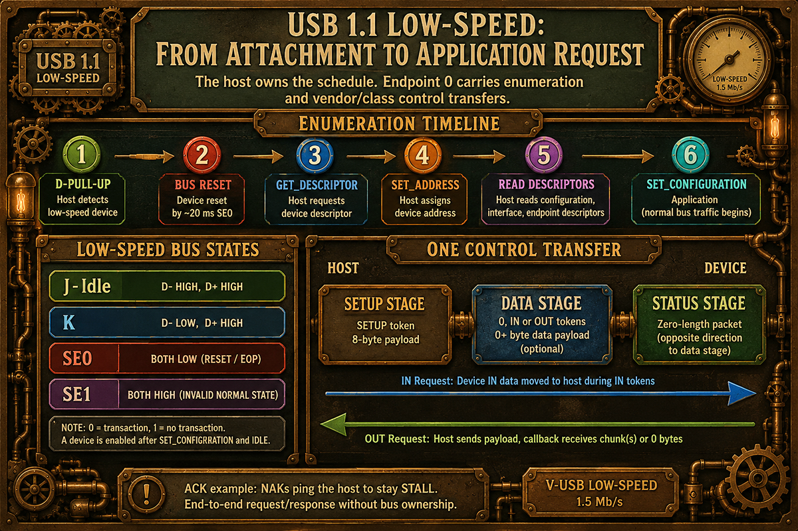
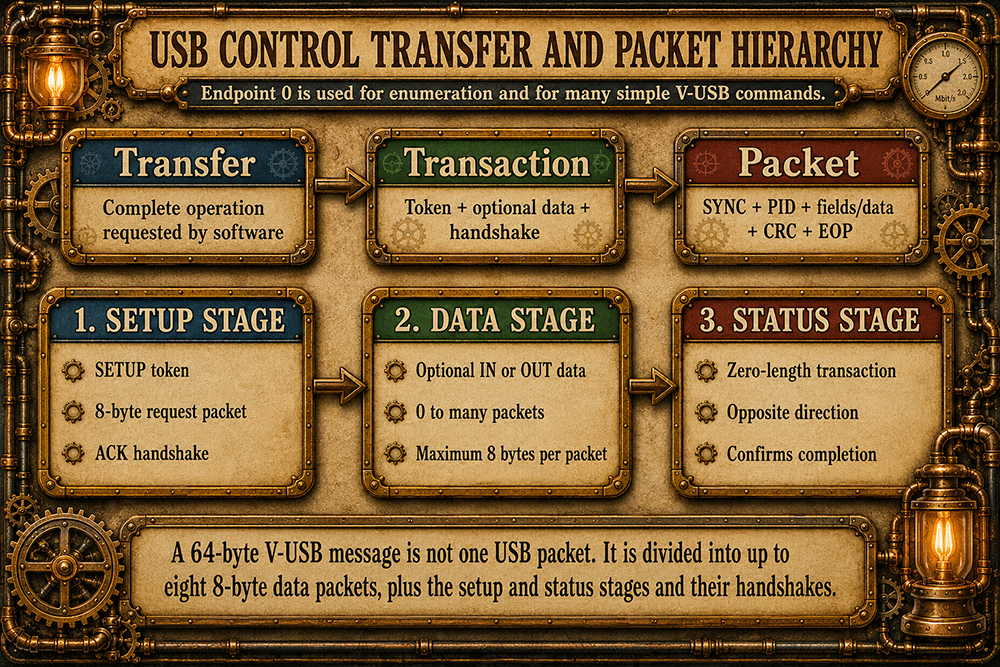
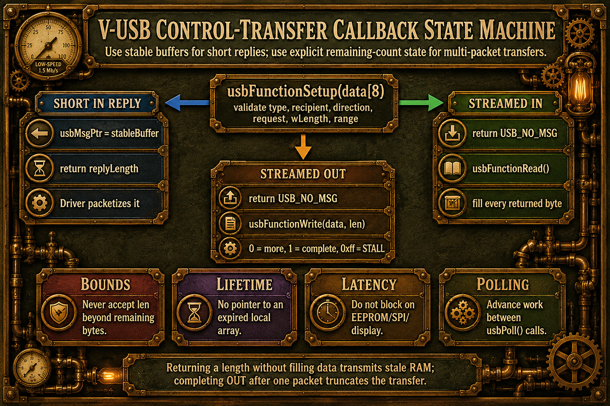
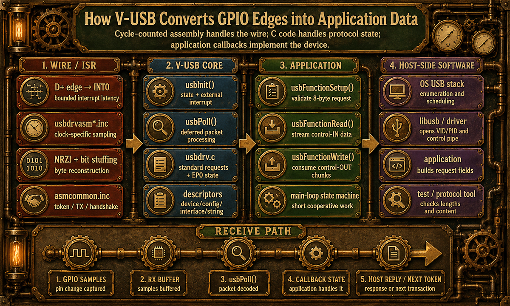
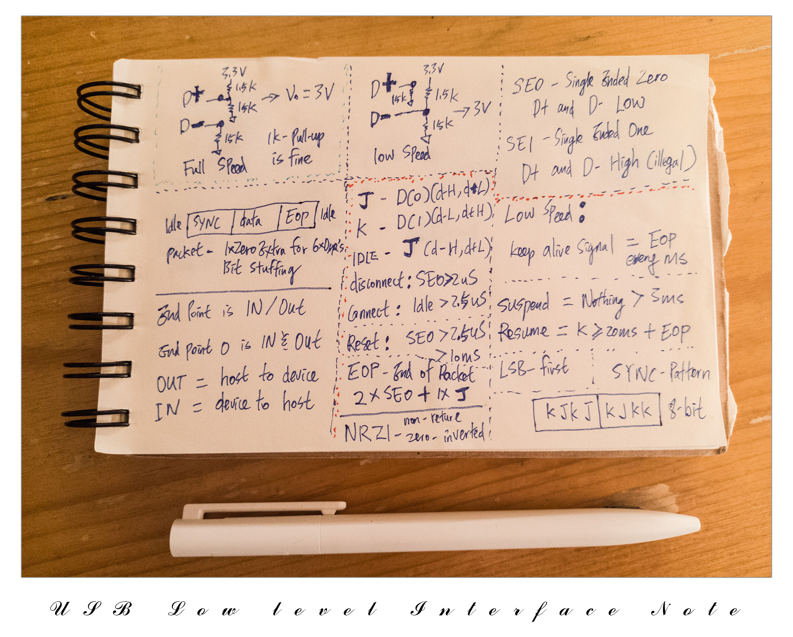

# VusbPro - Virtual USB Device Vusb Rewrite
### An AVR-GCC-focused V-USB development project for clearer firmware, easier host communication, and better practical speed

## Introduction

VusbPro is an active development project built from V-USB, the software USB implementation for classic 8-bit AVR microcontrollers. Its purpose is not merely to rename or reformat the original source. The project is focused on making V-USB easier to understand, easier to configure, easier to use from host software, and more dependable when transfer speed and code quality matter.

<p align="center">
  
</p>

V-USB makes it possible to build a low-speed USB device on AVR microcontrollers that do not contain a hardware USB peripheral. That capability is useful, but the original driver is timing-sensitive, spread across C and assembly, heavily controlled by configuration macros, and not immediately clear to a developer approaching it as a complete device system.



VusbPro addresses that problem as an engineering project. The driver, application firmware, hardware configuration, Windows driver, and host application are treated as one connected development path. The goal is to make each layer understandable without hiding the important technical details.

Speed is also treated as a measure of implementation quality. The FDxUISP USBasp modification is one practical example: it applies V-USB and USBasp optimization to a real programmer, then verifies the result through repeatable flash write and read testing. VusbPro uses the same direction—clearer code, controlled hardware behavior, measured performance, and fewer unnecessary limitations.

<br clear="left">


## Development Status and Completed Work

VusbPro is still under development. The current work establishes a cleaner base for future protocol, speed, programmer, bootloader, and example-project development.

Completed or already demonstrated work includes:

- The driver source has been reorganized for AVR-GCC development.
- Unused IAR-specific paths have been removed from the VusbPro branch.
- Outdated AVR and C constructs have been reviewed and simplified where practical.
- Source formatting and comments have been rewritten to make the control flow easier to follow.
- Original V-USB function names remain available for compatibility.
- A separate alias layer provides clearer application-facing names without rewriting timing-critical internal interfaces.
- Hardware selection supports Mini Heart II / xTimer, Fantasy, USBasp, and a custom configuration path.
- USB pin configuration remains in `usbconfig.h`, where V-USB expects it.
- A minimal initialization project has verified successful USB enumeration.
- A complete LED blinker example has been developed for Mini Heart II.
- The LED example supports OFF, ON, and a host-selected frequency from 1 to 10 Hz.
- Native Windows host examples have been created with C, the Win32 API, libusb, and WinUSB.
- A PowerShell host example has also been created as a lighter demonstration of the same protocol.
- Static and DLL-based libusb host builds have been explored.
- Technical documentation has been added for host-to-MCU data exchange.
- The original IDE-less AVR build batch files are preserved for the firmware workflow.
- FDxUISP development has already demonstrated the value of treating USBasp speed as an optimization target instead of accepting stock performance as fixed.

The project is not yet a finished general-purpose USB framework. Current releases should be treated as development milestones and technical examples rather than a frozen compatibility layer.

<p align="center">
  
</p>

## Project Direction

VusbPro has four main technical objectives:

1. **Ease of use** — reduce unnecessary configuration confusion and provide direct examples that can be built and modified without first reverse-engineering the entire driver.
2. **Code clarity** — separate application logic, hardware selection, USB configuration, and driver internals while preserving the timing-sensitive structure that V-USB requires.
3. **Practical speed** — measure real host-to-device and device-to-host performance, then optimize the firmware and host path based on test results.
4. **Complete examples** — provide both AVR firmware and host-side software so a developer can see the full data path instead of only one half of the USB system.

The planned development path includes:

- Continue cleaning and documenting the VusbPro driver base.
- Build a dedicated V-USB transfer-rate benchmark.
- Compare control-transfer performance at 12, 16, and 20 MHz.
- Separate raw V-USB throughput from USBasp, ISP, and target-flash overhead.
- Continue FDxUISP development as the main high-speed USBasp example.
- Develop a VusbPro-based USB bootloader with a clear host workflow.
- Add more small device examples that demonstrate one USB concept at a time.
- Expand reusable C/libusb host templates.
- Develop and document dedicated VusbPro-compatible AVR boards.

## The Complete USB Development Path

A working USB device requires more than the AVR driver alone. The complete path contains four layers:

```text
1. AVR application firmware
2. VusbPro USB driver
3. Windows USB function driver
4. Host application
```

For the current vendor-specific examples, the data path is:

```text
Windows C application
        |
        v
libusb-1.0
        |
        v
WinUSB.sys
        |
        v
USB host controller and cable
        |
        v
VusbPro on the AVR
        |
        v
AVR application code
```

The host application defines a command, libusb submits it to Windows, WinUSB provides the kernel communication path, the USB host controller sends it over D+ and D-, VusbPro decodes it, and the AVR application handles it.

<p align="center">
  
</p>

The VID and PID identify which connected USB device should be opened. They do not define the device protocol. The host and firmware must still agree on the meaning of every request number, value, returned byte, and error condition.

## Low-Speed Signaling, Hardware, and Timing

VusbPro receives USB through ordinary AVR GPIO pins, but the signals on those pins still follow USB low-speed rules. The host controls the bus, the device responds only when addressed, and the D+ and D- states are decoded through the interrupt-driven V-USB receive path. NRZI encoding, bit stuffing, packet timing, CRC handling, and endpoint state are handled by the driver rather than by the application code.

<p align="center">
  
</p>

The hardware interface must also keep the USB lines within the expected voltage range and use a pin arrangement supported by the selected V-USB timing implementation. The reference below summarizes the host connection, AVR pin roles, common voltage-interface choices, and supported clock families.

<p align="center">
  
</p>

## Source Organization

A VusbPro project is divided into three technical areas.

### Application firmware

The application contains the project-specific behavior. Examples include blinking an LED, reading a button, sending a counter value, programming another AVR, or implementing a bootloader command.

The application should initialize the hardware, initialize VusbPro, perform the USB disconnect/reconnect sequence when required, enable interrupts, and call the USB processing function continuously.

### VusbPro driver

The driver contains the USB packet handling, request processing, endpoint logic, and timing-critical assembly. Most projects should not modify the assembly merely to implement a new USB command. Application-level communication normally belongs in the callback functions provided by the driver.

### Configuration

`VusbPro.h` contains project-level selections and readable VusbPro settings. `usbconfig.h` contains the V-USB configuration macros and the final USB pin mapping used by the driver.

Hardware selection is intentionally simple:

```c
//1 = Mini Heart II / xTimer  - D- D4, D+ D2/INT0
//2 = Fantasy                 - D- D3, D+ D2/INT0
//3 = usbasp                  - D- B0, D+ B1, D+ also wired to D2/INT0
//4 = Custom
#define VusbPro_HARDWARE 1
```

Custom hardware uses selection 4 and supplies the required port and bit settings before compilation.

## How the Firmware Starts

A minimal firmware follows this sequence:

```c
int main(void){
  //Initialize application hardware.

  usb_initialize();

  usbDeviceDisconnect();
  _delay_ms(250);
  usbDeviceConnect();

  sei();

  while(1){
    usb_processing();

    //Run non-blocking application logic here.
  }
}
```

The disconnect delay forces the host to recognize a fresh connection after reset or reprogramming. The main loop must call the USB processing function frequently. Long blocking delays, slow peripheral operations, and excessive work between calls can reduce reliability or throughput.

After attachment, the host resets and enumerates the device before the application protocol can be used. Every control request then proceeds through a setup stage, an optional data stage, and a status stage.

<p align="center">
  
</p>

The Mini Heart II LED example uses PD7 as an active-low output. The LED is OFF by default, and the host can enable blinking and select a frequency from 1 to 10 Hz.

## VusbPro Request Handling

A USB control transfer is larger than the application command alone. The host wraps the request in the standard USB setup, optional data, and status stages. The VusbPro application normally works with the decoded setup fields rather than the individual wire packets.

<p align="center">
  
</p>

V-USB uses callbacks. The application does not repeatedly call a function asking whether a particular command arrived. Instead, the driver receives and decodes the USB request, then calls the application function assigned to handle it.

The main setup-request entry point is:

```c
usbMsgLen_t usbFunctionSetup(uchar data[8]){
  usbRequest_t *request = (usbRequest_t *)data;

  //Interpret request->bRequest, request->wValue,
  //request->wIndex and request->wLength here.
}
```

The eight setup bytes are interpreted as a `usbRequest_t` structure. For a small command, the request number may identify the operation and `wValue` may carry the setting. For example:

```text
Request 1, Value 0  = Blinker OFF
Request 1, Value 1  = Blinker ON
Request 2, Value 7  = Set frequency to 7 Hz
Request 3           = Return current state and frequency
```

These meanings are not assigned by USB or libusb. They are the application protocol defined jointly by the host code and AVR firmware.

For short transfers, `usbFunctionSetup()` can return the reply length directly. For larger transfers, V-USB can continue through `usbFunctionRead()` or `usbFunctionWrite()` so data can be generated or consumed in small pieces without requiring one large AVR RAM buffer.

<p align="center">
  
</p>

## What `usbPoll()` Actually Does

<p align="center">
  
</p>

The USB pins are observed through interrupt-driven timing code. `usbPoll()` does not electrically poll D+ and D- in the same sense as repeatedly reading two GPIO pins. It processes packet information that the low-level receive code has captured and advances the USB state machine in the main program context.

A simplified control flow is:

```c
//Low-level receive and timing code captures the USB packet.

void usbPoll(void){
  //Process a received packet when one is ready.
}

void usbProcessRx(uint8_t *data, uint8_t len){
  //Decode the packet and dispatch the request.
  replyLen = usbFunctionSetup(data);
}
```

This separation is important. The interrupt and assembly path must meet strict USB timing. The higher-level C code interprets requests and connects them to the application.

## Host-Side Software

The current Windows examples use a vendor-specific USB device type with libusb and WinUSB.

### WinUSB

WinUSB is the Windows function driver assigned to the device. It provides the kernel-level path between a normal Windows application and the USB device. A vendor-specific device normally needs a suitable driver association before a libusb application can open it.

Installing WinUSB does not teach Windows what each VusbPro command means. It only provides a supported communication path to the device.

### libusb

libusb provides the host application with functions for finding the device, opening it, sending USB transfers, receiving data, reporting errors, and closing the connection.

For the LED example, the C host uses a standard control transfer. Conceptually, the host sends:

```text
Request type: Vendor-specific, host to device
Request:      Set blinker state
Value:        0 or 1
Data stage:   None
```

The same mechanism is used to send the requested frequency or read the current status.

### Native C host

The native host example is written in C with the Win32 API. It uses standard Windows controls and calls libusb directly. This is the preferred direction for a small Windows utility because it has low overhead, no managed runtime requirement, direct access to libusb, and broad compatibility when built for the correct Windows architecture.

The PowerShell program remains useful as an educational example because the USB commands can be tested without first building a full native application. It is not the preferred platform for final speed measurements.

## Driver and Device Type

The current application examples use USB class `0xFF`, meaning vendor-specific. This is suitable when the project defines its own small command protocol and uses libusb on the host.

A standard class such as HID should be selected only when its standard behavior is useful. HID may avoid a custom driver installation, but it also imposes HID descriptors, report formats, polling limits, and host-side conventions. Vendor-specific control transfers are simpler for direct experiments with VusbPro and for transfer-rate testing.

## Performance Development

VusbPro does not treat the original USB speed as an untouchable result. Performance must be separated into layers and measured.

A useful benchmark should test:

- Host-to-AVR control transfers without storing the data.
- AVR-to-host control transfers using generated data.
- Raw mode with minimal byte processing.
- Verified mode with a known data pattern and error counter.
- Different control-transfer lengths.
- AVR clock builds at 12, 16, and 20 MHz.
- The effect of CRC and application-side processing options.
- Direct VusbPro throughput before USBasp or target programming is added.

This distinction matters because a USBasp programming result includes several possible limits:

```text
Host application overhead
libusb and Windows transfer overhead
V-USB control-transfer overhead
USBasp command handling
ISP clock rate
Target flash page timing
Verification reads
```

FDxUISP is an important VusbPro-related example because it turns that analysis into a real programmer. It shows that USBasp-derived firmware should be evaluated through measured write and read performance, not only by whether it can program a target successfully.

## Development Rules

VusbPro development follows several practical rules:

- Preserve timing-critical assembly unless a change is deliberate, measured, and tested.
- Keep hardware selection separate from application behavior.
- Keep final V-USB pin macros in `usbconfig.h`.
- Preserve original V-USB names where compatibility is useful.
- Add readable aliases without forcing applications to use them.
- Avoid long blocking work in the main loop.
- Do not use a large RAM buffer when the transfer can be streamed.
- Measure both speed and data correctness.
- Test on real Windows systems, host controllers, cables, and AVR hardware.
- Treat each working milestone as a controlled base for the next change.

## Current Limitations

VusbPro inherits the physical and protocol limits of low-speed V-USB. It is not a replacement for a microcontroller with a hardware full-speed USB peripheral.

Important limitations include:

- The USB signaling rate remains low-speed USB.
- Packet sizes and endpoint choices are restricted.
- Driver timing depends on supported AVR clock configurations.
- Long interrupt blocking can break USB communication.
- Vendor-specific Windows applications require a suitable function driver such as WinUSB.
- A USB Mass Storage flash drive is not an appropriate primary target because standards-compliant low-speed USB does not support the bulk endpoints normally used by Mass Storage.

These limits do not make V-USB useless. They define where careful engineering matters and where a hardware USB MCU is the better tool.

## Intended Use

VusbPro is intended for developers who want to study or build:

- Small vendor-specific USB devices.
- USB-controlled AVR applications.
- Sensor, switch, LED, and control interfaces.
- USBasp-derived programmers such as FDxUISP.
- Small USB bootloaders.
- Host-to-MCU protocol examples.
- V-USB speed and timing experiments.
- Educational projects that include both firmware and host software.

The project assumes familiarity with AVR C, registers, interrupts, pointers, USB descriptors, and basic host-side programming. The documentation is intended to make the system traceable, not to hide the underlying mechanisms.

<p align="center">
  
</p>

## Buy Me a Coffee

[](https://paypal.me/flyandance?country.x=US&locale.x=en_US)
